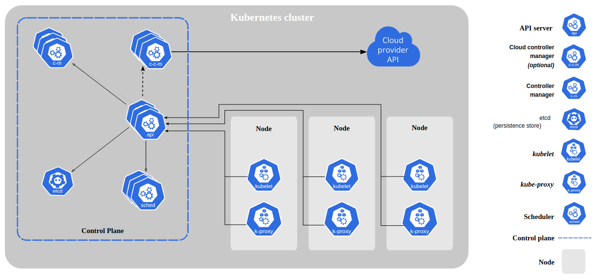
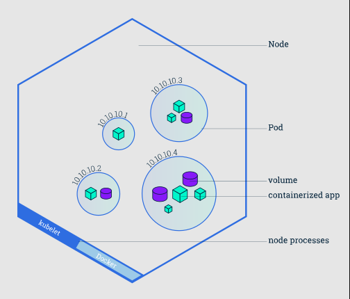

# Kubernetes Concepts and Building a Cluster

To work with Kubernetes, you use Kubernetes API objects to describe your cluster’s desired state: what applications or other workloads you want to run, what container images they use, the number of replicas, what network and disk resources you want to make available, and more.<br>
You set your desired state by creating objects using the Kubernetes API, typically via the command-line interface,`kubectl`. You can also use the Kubernetes API directly to interact with the cluster and set or modify your desired state.<br>

Once you’ve set your desired state, the Kubernetes Control Plane works to make the cluster’s current state match the desired state. To do so, Kubernetes performs a variety of tasks automatically, such as starting or restarting containers, scaling the number of replicas of a given application, and more.<br>

The Kubernetes Control Plane is a collection of three processes that run on a single node in your cluster, which is designated as the Control Plane node. Those processes are: kube-apiserver, kube-controller-manager and kube-scheduler.<br>

Each individual non-Control Plane node in your cluster runs two processes:

- kubelet, which communicates with the Kubernetes Control Plane.
- kube-proxy, a network proxy which reflects Kubernetes networking services on each node.
  <br>
  The various parts of the Kubernetes Control Plane, such as the kube-apiserver and kubelet processes, govern how Kubernetes communicates with your cluster. The Control Plane maintains a record of all of the Kubernetes Objects in the system, and runs continuous control loops to manage those objects’ state. At any given time, the Control Plane’s control loops will respond to changes in the cluster and work to make the actual state of all the objects in the system match the desired state that you provided.
  <br>
  
  For example, when you use the Kubernetes API to create a Deployment object, you provide a new desired state for the system. The Kubernetes Control Plane records that object creation, and carries out your instructions by starting the required applications and scheduling them to cluster nodes–thus making the cluster’s actual state match the desired state.
  <br>

## Kubernetes Control Plane

The Kubernetes Control Plane is responsible for maintaining the desired state for your cluster. When you interact with Kubernetes, such as by using the kubectl command-line interface, you’re communicating with your cluster’s Kubernetes Control Plane.
<br>
The “Control Plane” refers to a collection of processes managing the cluster state. Typically these processes are all run on a single node in the cluster, and this node is also referred to as the Control Plane. The Control Plane can also be replicated for availability and redundancy.
<br>

## Kubernetes Nodes

The nodes in a cluster are the machines (VMs, physical servers, etc) that run your applications and cloud workflows. The Kubernetes Control Plane controls each node; you’ll rarely interact with nodes directly.<br>


Kubernetes contains a number of abstractions that represent the state of your system: deployed containerized applications and workloads, their associated network and disk resources, and other information about what your cluster is doing. These abstractions are represented by objects in the Kubernetes API.

A Pod is the basic building block of Kubernetes–the smallest and simplest unit in the Kubernetes object model that you create or deploy. A Pod represents a running process on your cluster.

A Pod encapsulates an application container (or, in some cases, multiple containers), storage resources, a unique network IP, and options that govern how the container(s) should run. A Pod represents a unit of deployment: a single instance of an application in Kubernetes, which might consist of either a single container or a small number of containers that are tightly coupled and that share resources.

Pods in a Kubernetes cluster can be used in two main ways:

Pods that run a single container. The “one-container-per-Pod” model is the most common Kubernetes use case; in this case, you can think of a Pod as a wrapper around a single container, and Kubernetes manages the Pods rather than the containers directly.

Pods that run multiple containers that need to work together. A Pod might encapsulate an application composed of multiple co-located containers that are tightly coupled and need to share resources. These co-located containers might form a single cohesive unit where one container serving files from a shared volume to the public, while a separate container refreshes or updates those files. The Pod wraps these containers and storage resources together as a single manageable entity.

Each Pod is meant to run a single instance of a given application. If you want to scale your application horizontally (e.g., run multiple instances), you should use multiple Pods, one for each instance.

In Kubernetes, this is generally referred to as replication. Replicated Pods are usually created and managed as a group by an abstraction called a Controller, for example a ReplicaSet controller (to be discussed) maintains the Pod lifecycle. This includes Pod creation, upgrade and deletion, and scaling.

See Pods and Controllers for more information.

Containers in a pod run in the same Network namespace, so they share the same IP address and port space.

All the containers in a pod also have the same loopback network interface, so a container can communicate with other containers in the same pod through localhost.

# Getting Started

### Step 1 - Set up each server in the cluster to run Kubernetes.

On each of the three Ubuntu 18.04 servers run the following commands as root, you can type the commands or highlight and copy/paste in the terminal window on the left:

- Download the Google Cloud public signing key:
  `curl -fsSLo /usr/share/keyrings/kubernetes-archive-keyring.gpg https://packages.cloud.google.com/apt/doc/apt-key.gpg`
- Add the Kubernetes apt repository:
  `echo "deb [signed-by=/usr/share/keyrings/kubernetes-archive-keyring.gpg] https://apt.kubernetes.io/ kubernetes-xenial main" | sudo tee /etc/apt/sources.list.d/kubernetes.list`
- Update apt package index with the new repository and install the utilities:
  `apt update`
  `apt install -y kubelet kubeadm kubectl docker.io`
  `apt-mark hold kubelet kubeadm kubectl`
- Kubelet: The primary agent that runs on a kubernetes node and communicates with the control plane to issue commands to this node and report status
- Kubeadm: A tool that performs the actions necessary to build up a Kubernetes cluster
- Kubectl: The command line tool that lets you control Kubernetes clusters and issue commands to the api-server
- Docker Engine: A container engine used by Kubernetes to run containers

### Step 2: Setup the Kubernetes Control Plane

Next, we are going to configure the Docker daemon to use systemd for the management of the container’s cgroups, copy the following block and paste it in the terminal window of each node {Control Plane, kube-02, kube-03}:

```
mkdir /etc/docker
cat <<EOF | sudo tee /etc/docker/daemon.json
{
  "exec-opts": ["native.cgroupdriver=systemd"],
  "log-driver": "json-file",
  "log-opts": {
    "max-size": "100m"
  },
  "storage-driver": "overlay2"
}
EOF

systemctl enable docker
systemctl daemon-reload
systemctl restart docker
```

On the Control Plane node only, run this command in order to initialize the Kubernetes control plane:
`kubeadm init --ignore-preflight-errors=all`
This can take a minute or two to run.

Before we begin using the cluster, we need to configure the kubectl command line tool that let us control the cluster. For configuration, kubectl looks for a file named config in the $HOME/.kube directory.

- Create the directory:
  `mkdir -p $HOME/.kube`
- Copy the config file generated by kubeadm to $HOME/.kube/:
  `cp -i /etc/kubernetes/admin.conf $HOME/.kube/config`
- Change ownership of the file to the current logged in user:
  `chown $(id -u):$(id -g) $HOME/.kube/config`

### Step 3: Join your nodes to your Kubernetes cluster

You can now join any number of machines by running the kubeadm join command on each node as root.

To join kube-02 and kube-03 as worker nodes to the cluster, we need the token generated by the kubeadm init command.

- Run the following command on the Control Plane node:
  `kubeadm token create --print-join-command`
  Copy the output and run it on both worker nodes {kube-02, kube-03}.

- When you join your worker nodes you will see the following output:

```This node has joined the cluster:
* Certificate signing request was sent to Control Plane and a response was received.
* The Kubelet was informed of the new secure connection details.
```

- To check that all nodes are now joined to the Control Plane run the following command on the Kubernetes Control Plane node:
  `kubectl get nodes`
- The successful result will look like this:

```
NAME      STATUS    ROLES     AGE       VERSION
kube-01   NotReady     master    8m        v1.x.x
kube-02   NotReady     <none>    6m        v1.x.x
kube-03   NotReady     <none>    6m        v1.x.x
```

### Step 4: Setup a Kubernetes Add-On For Networking

Kubernetes Add-Ons are pods and services that implement cluster features. Pods extend the functionality of Kubernetes. You can install addons for a range of cluster features including Networking and Visualization.

We are going to install the Weave Net Add-On on the kube-01 Control Plane, which provides networking and network policy, will carry on work on both sides of a network partition, and does not require an external database. Read more about the Weave Net Add-on in the Weave Works Docs.

Weave-net is a CNI plugin which provides a virtual network that connects docker containers across multiple hosts.

By default Kubernetes comes with a simple network plugin that does not have the overlay networking capabilities.

Next you will deploy a pod network to the cluster.

The options are listed at: https://kubernetes.io/docs/concepts/cluster-administration/addons/

#### Installing the Weave Net Add-On

- On the Control Plane node, run the kubectl apply command which will create all the networking resources in the cluster from the supplied manifest file:
  `kubectl apply -f "https://cloud.weave.works/k8s/net?k8s-version=$(kubectl version | base64 | tr -d '\n')"`
- The result will look like this:

```
serviceaccount "weave-net" created
clusterrole "weave-net" created
clusterrolebinding "weave-net" created
role "weave-net" created
rolebinding "weave-net" created
daemonset "weave-net" created
```

- It may take a minute or two for DNS to be ready, continue to check for DNS to be ready before moving on by running the kubectl get command which allow us to display the resources and prints a table of the most important information about the specified resources:

```
watch kubectl get pods --all-namespaces
CTRL+C to exit
```

- The successful result will look like this, every container should be running:

```
NAMESPACE     NAME                              READY     STATUS    RESTARTS   AGE
kube-system   etcd-kube-01                      1/1       Running   0          5m
kube-system   kube-apiserver-kube-01            1/1       Running   0          6m
kube-system   kube-controller-manager-kube-01   1/1       Running   0          5m
kube-system   kube-dns-6f4fd4bdf-whbhd          3/3       Running   0          6m
kube-system   kube-proxy-2hdhk                  1/1       Running   0          6m
kube-system   kube-proxy-tvhjk                  1/1       Running   0          5m
kube-system   kube-proxy-wspmv                  1/1       Running   0          5m
kube-system   kube-scheduler-kube-01            1/1       Running   0          6m
kube-system   weave-net-9ghn5                   2/2       Running   1          5m
kube-system   weave-net-lh8tq                   2/2       Running   0          5m
kube-system   weave-net-qhr25                   2/2       Running   0          5m
```

- Check the nodes status again:
  `kubectl get nodes`

```
NAME      STATUS    ROLES     AGE       VERSION
kube-01   Ready     Control Plane    8m        v1.x.x
kube-02   Ready     <none>    6m        v1.x.x
kube-03   Ready     <none>    6m        v1.x.x
```

### Step 5: Deploying The Microservices Sock Shop

Next we will deploy a demo microservices application to your kubernetes cluster.

- First, on Control Plane, clone the microservices sock shop git repo:
  `git clone https://github.com/microservices-demo/microservices-demo.git`

- Go to the microservices-demo/deploy/kubernetes folder:
  `cd microservices-demo/deploy/kubernetes`
- Next apply the demo to your kubernetes cluster:
  `kubectl apply -f complete-demo.yaml`
- You will see the following result

```
deployment "carts-db" created
service "carts-db" created
deployment "carts" created
service "carts" created
deployment "catalogue-db" created
service "catalogue-db" created
deployment "catalogue" created
service "catalogue" created
deployment "front-end" created
service "front-end" created
deployment "orders-db" created
service "orders-db" created
deployment "orders" created
service "orders" created
deployment "payment" created
service "payment" created
deployment "queue-Control Plane" created
service "queue-Control Plane" created
deployment "rabbitmq" created
service "rabbitmq" created
deployment "shipping" created
service "shipping" created
deployment "user-db" created
service "user-db" created
deployment "user" created
service "user" created
```

- Check to see if all of your pods are running:

```
watch kubectl get pods --namespace sock-shop
CTRL+C to exit
```

- You will see the following result when all pods are ready, they will have the status of “Running”:

```
NAMESPACE     NAME                              READY     STATUS    RESTARTS   AGE
sock-shop     carts-74f4558cb8-h9924            1/1       Running   0          11m
sock-shop     carts-db-7fcddfbc79-v64fw         1/1       Running   0          11m
sock-shop     catalogue-676d4b9f7c-55n4g        1/1       Running   0          11m
sock-shop     catalogue-db-5c67cdc8cd-hvk96     1/1       Running   0          11m
sock-shop     front-end-977bfd86-hq9x9          1/1       Running   0          11m
sock-shop     orders-787bf5b89f-xfdl6           1/1       Running   0          11m
sock-shop     orders-db-775655b675-gv456        1/1       Running   0          11m
sock-shop     payment-75f75b467f-4zzqs          1/1       Running   0          11m
sock-shop     queue-Control Plane-5c86964795-t8sjg     1/1       Running   0          11m
sock-shop     rabbitmq-96d887875-lf46w          1/1       Running   0          11m
sock-shop     shipping-5bd69fb4cc-vprmp         1/1       Running   0          11m
sock-shop     user-5bd9b9c468-4rms8             1/1       Running   0          11m
sock-shop     user-db-5f9d89bbbb-r69pd          1/1       Running   0          11m
```
